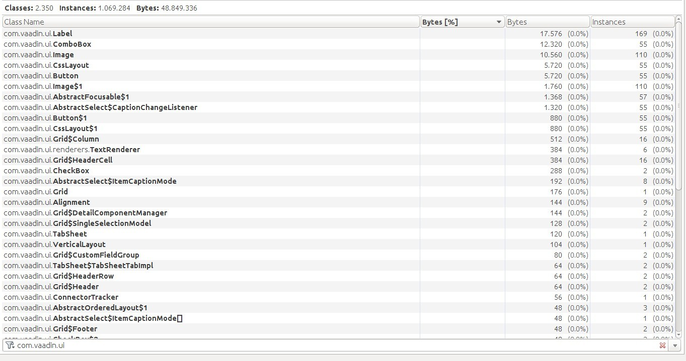
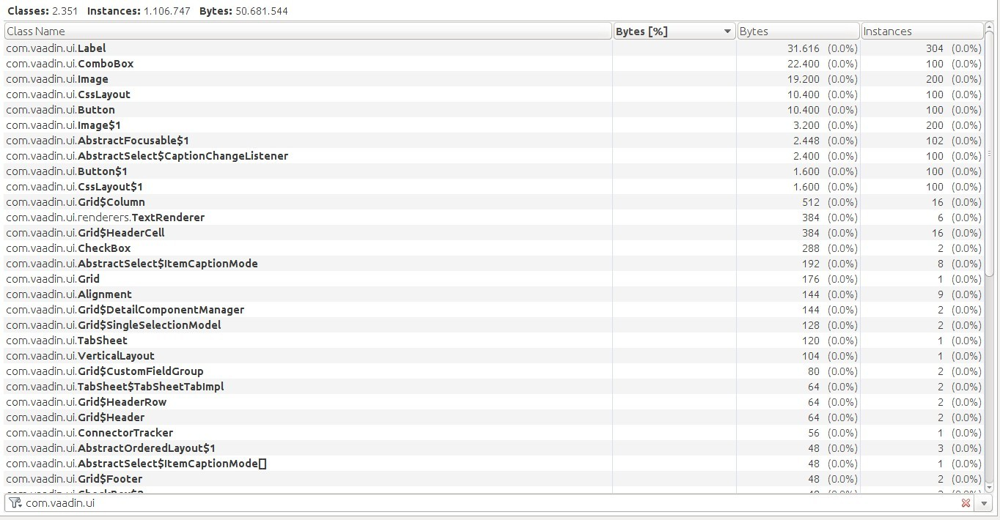
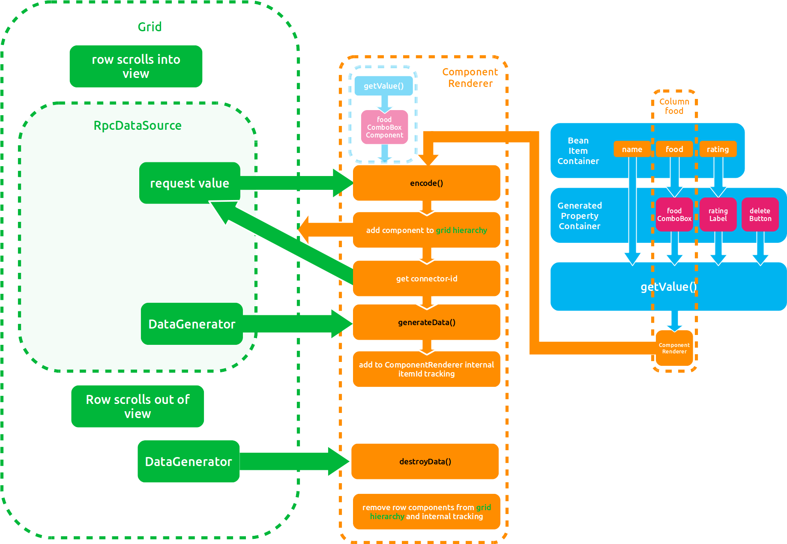

# ComponentRenderer

Renders standard Vaadin components in the grid.

## Features
 * Plain Java server side coding, as usual
 * Standard Tooltips work
 * Components can be combined in layouts (e.g. multiple images in a horizontal layout)
 * Works with standard colums and generated columns
 * Standard ValueChange/ClickListeners
 * Supports Keyboard-Navigation (ENTER focuses the component inside the cell or its input field if it has one, ESC
   switches the focus back to the surrounding cell, so navigating through the grid with the arrow keys can continue)
 * Open and Close the row-details with CTRL + DOWN and CTRL + UP
 * Preserve the grid focus on manual triggered refresh
 * creates component editor fields for the grid editor (display or unbuffered-edit only)
 
## Limitations

 * Components inside a cell should have fixed sizes, otherwise all browsers expect Chrome do lots of measurements
   and relayout which slows down rendering
 * Created Editor-Fields just show the components from the cell 1:1, works nicely for displaying only components,
   for fields any changes to the underlying properties are up to your implementation, buffered-mode has no
   effect
   
## Important info

 * see componentrenderer.scss for styling info
 * make sure you add the addons.scss to your own theme, so the componentrenderer's default styles get loaded,
   they vertically center the components in the cells
   
## Bugs & Features

Please report bugs or feature-wishes in the github issue-tracker to further improve this renderer.
   
## Use the renderer

Add this dependency to your pom

    <dependency>
        <groupId>de.datenhahn.vaadin</groupId>
        <artifactId>componentrenderer</artifactId>
        <version>ENTER VERSION HERE</version>
    </dependency>

then recompile the widgetset.

## Demo Application

Have a look at the demo app, you can start it with:
    
    cd componentrenderer-demo
    mvn jetty:run
    
## Use with standard grid

Example using the renderer with the standard Vaadin grid, see Demo Source-Code for complete example.

    // don't forget to activate all extensions (ComponentGrid automatically adds these)
    ComponentCellKeyExtension.extend(grid);
    focusPreserveExtension = FocusPreserveExtension.extend(grid);
    DetailsKeysExtension.extend(grid);
    
    myGrid.addColumn(COL_DELETE, Component.class).setRenderer(new ComponentRenderer());
    //...
    generatedPropertyContainer.addGeneratedProperty(COL_DELETE, new DeleteButtonValueGenerator(myGrid));
    
    //...
    // You can use the FocusPreserveExtension to refresh the grid withoud losing the current
    // cell focus
    focusPreserveExtension.saveFocus();
    grid.setCellStyleGenerator(grid.getCellStyleGenerator());
    focusPreserveExtension.restoreFocus();

## Use with the ComponentGrid supplied with the renderer

Example using the renderer with the ComponentGrid, see Demo Source-Code for complete example.

    grid.addComponentColumn(FOOD, cust -> createFoodSelector(grid, cust));
    grid.addComponentColumn(FOOD_ICON, cust -> createFoodIcon(cust));
    
## Using the componentrenderers addon stylesheet

To use the componentrenderers automatic addon stylesheet which centers components correctly
include the addons.scss in your theme, have a look at the demotheme:

    @import "../valo/valo.scss";
    @import "addons.scss";
    
    .demotheme {
      @include valo;
      @include addons;

## OSGI

If you want to add the serverside parts of the renderer as OSGI bundle, you can
use the karaf feature (if you use karaf) which installs automatically all needed
dependencies (including vaadin).

    feature:repo-add mvn:de.datenhahn.vaadin/componentrenderer/0.3.4/xml/features
    feature:install vaadin-componentrenderer
    
Or you use the classic way only installing the componentrenderer bundle:
    
    bundle:install -s mvn:de.datenhahn.vaadin/componentrenderer/0.3.4
    
To see all dependencies have a look at the features.xml, most come from vaadin itself:

[features.xml](https://github.com/datenhahn/componentrenderer/blob/master/componentrenderer/src/main/resources/features.xml)

## Keyboard-Navigation

There are two extensions improving on keyboard navigation.

### ComponentCellKeyExtension

With the arrow keys you can navigate through the grid, but if you wanted to press a component-button in a cell
or if you wanted to change a dropdown you had to use the mouse. This extensions adds two new keyboard actions:
 
 * Press ENTER to focus the component inside a cell
 * Press ESC to switch focus back to the cell so you can continue navigating
  
### DetailsKeysExtension

You also want to open/close the details-rows with the keyboard. So this extension adds the following to keyboard actions:
 
 * Press CTRL+DOWN_ARROW to expand the details of the current row
 * Press CTRL+UP_ARROW to collapse the details of the current row and its row above. The grid cursors movement
   cannot be stopped, so when pressing the DOWN_ARROW the cursor always moves to the next row.
   The closing of the row above the cursor is a hack to allow flicking open and shut details without
   having to reposition the cursor)

## Focus Preserving refresh

When rerendering the grid looses its focus. I fixed that by suppling functions for saving and restoring
the current focus. The ComponentGrid's <tt>refresh()</tt> function automatically makes use of that.

<b>Standard Grid</b>

    focusPreserveExtension.saveFocus();
    grid.setCellStyleGenerator(grid.getCellStyleGenerator());
    focusPreserveExtension.restoreFocus();

<b>ComponentGrid</b>

    grid.refresh()
    
In case you wonder <tt>grid.setCellStyleGenerator(grid.getCellStyleGenerator());</tt> is a nasty hack to force the
grid to rerender.

## HeaderGenerator

The header generators make it very easy to generate headers for all bean properties and generated properties. See
the ResourceBundleComponentHeaderGenerator for an example.

    componentGridDecorator.generateHeaders(new ResourceBundleTextHeaderGenerator(ViewComponents.getLabels()));

The method <tt>generateHeaders</tt> calls the HeaderGenerators <tt>getHeader</tt> method for every property and
sets its header-caption. You should use that method once you have set the columns you want to use.

There are the following types of HeaderGenerators:

 * TextHeaderGenerator
 * HtmlHeaderGenerator
 * ComponentHeaderGenerator

# Server-Side Memory Use

I used jvisualvm to check if the components were released correctly. Below you find the screenshots.

## Initial Load

The grids initially displayed rows are loaded, memory use about 50MB.

## Scroll to row 1000 (ARROW_DOWN key) before GC

During scrolling we create a lot of objects, memory use before GC about 400MB.

## Scroll to row 1000 (ARROW_DOWN key) after GC

But the generated objects do not stay in heap, but can be garbage collected which we can
observe here. After GC again only about 50MB of memory is used. The number of instances
left (100) is the amount the grid's RpcDataSource holds in its row-cache.

# Internals of the renderer explained

Here you find a description how the renderer works. You won't need that to use the renderer, but
it may be useful if you want to extend it or when writing your own renderers.

## Grid basics for writing renderers

Before starting to extend the grid I recommend watching this video. Leif explain very detailed
the mechanics of the grid.

<b>GWT.create 2015 - Improving the HTML table (Leif Åstrand)</b>

<https://www.youtube.com/watch?v=Yi8ioIHTnZw>

Other resources

 * <b>Book of Vaadin: Renderers</b> <https://vaadin.com/docs/-/part/framework/clientsidewidgets/clientsidewidgets-grid.html>
 * <b>Blog-Post: Vaadin 7.5 - Grid Extensions</b> <https://vaadin.com/blog/-/blogs/vaadin-7-5-grid-extensio-1>

### ItemId, RowIndex and RowKey explained

When programming for the grid you will encounter these different keys for identifying rows. Be sure to convert
correctly when you do not receive the type of key you need.

 * the <b>itemId</b> is the id of the serverside vaadin container, it may be a bean for example when using the
   BeanItemContainer
 * the <b>rowIndex</b> is the index of an IndexedContainer (all grid containers have to implement Container.Indexed)
 * the <b>rowKey</b> is an internal row key of the clientside grid implementation

<b>Conversions</b>

 * <b>rowKey -> itemId</b> the AbstractGridExtension contains a method getItemId(String rowKey)
 * <b>rowIndex -> itemId</b> Container.Indexed contains a method getItemIds(int startIndex, int numberOfItems)
   if you do getItemIds(rowIndex,1).get(0) you get the itemId of the rowIndex

## Lifecycle of rendering a cell

Now you should have a basic understanding how the grid's internals work and we will look into the lifecycle
of rendering a cell.

 1. <b>client-side</b>: the grid is in need for data (first load, or scrolling)
 2. the grid requests the needed range of rows from its DataSource, which in the default implementation is
    the RpcDataSource.
 3. the RpcDataSource makes a request to its server-side counterpart
 4. <b>server-side</b>: for each column the associated renderer is asked to encode the data from the container
 5. the renderer uses <tt>getValue()</tt> to retrieve the serverside java value object which it will encode to json
 6. before receiving the value converters are applied to convert from data model to presentation form
 7. the renderer's serverside <tt>encode(T value)</tt> function is called. T is the presentation type this renderer supports.
 8. (since 7.6) if any DataGenerators are registered with the grid the DataGenerator its <tt>generateData(Object itemId, Item item, JsonObject jsonObject)</tt> function is called.
    the fully json encoded row is passed to this function and additional modifications can be made by the DataGenerator (e.g. add
    additional information)
 9. <b>client-side</b>: the renderer's client-side connector retrieves the json value it should display and uses the <tt>decode(JsonValue jsonConnectorId)</tt>
    function of its connector.
 10. now the client-side renderer's <tt>render(...)</tt> function is called. It gets passed the cell-reference and the
     value it is supposed to display as returned from the <tt>decode(...)</tt> function. When you are using a WidgetRenderer
     you also have access to the widget contained in the cell.
 11. <b>the row scrolls out of sight and out of the row-cache</b>
 12. the row's data which is cached on the client-side is destroyed
 13. <b>server-side</b>(since 7.6) if DataGenerators are registered with the grid the <tt>destroyData(Object itemId)</tt> function of the
     DataGenerator is called.

## The complete rendering lifecycle of the component renderer

### Problems I encountered (with vaadin 7.5)
 1. although the grid implements <tt>HasComponents</tt> it does keep track of components in its hierarchy in its own way,
   meaning if you do <tt>setParent(grid)</tt> on a component it will <b>not</b> be added to the grid's child
   components and therefore it will have no effect (not added to the hierarchy) :(
   <i>I circumvented that in my first trys by keeping of the renderer-components myself and overwriting the
   <tt>iterator()</tt> method of the grid (either by extending from Grid, or by a cglib-decorator) adding my
   renderer components to the grid's own tracked components</i>
 2. Adding components to the hierarchy slows down the component. So a grid with 1000 rows worked, but with 10000 rows
   it got barely useable, that was in chrome. Firefox seems not to do some optimisations or is in general much
   slower in measuring/preventing reflow. It was killed already by several hundreds of rows.
   <b>Conclusion: you want to keep as little components in the hierarchy as possible</b>
 3. When vaadin renders a component with relative size it determines all sizes of the components involved and does
   some calculations to translate the percent values into absolute values. That is part of the vaadin magic. Unfortunately
   measuring an element causes the browser to reflow/relayout, doing it a lot of time results in a severe slowing-down
   effect called "layout thrashing" (https://developers.google.com/web/fundamentals/performance/rendering/avoid-large-complex-layouts-and-layout-thrashing).
   The vaadin core is already highly optimized to minimize reflow, but some browsers are better (chrome) than others
   (firefox) in measuring elements and optimizing reflow.
 4. Whereas you have a clear entrypoint when components have to be available to the renderer and therefore added to the
   hierarchy (<tt>encode()</tt>) there was no possibility to determine when it is not needed anymore.
   <i>I tried to circumvent that by keeping track of the components widgets (if a widget in a cell was replaced with
   a different one I could throw the component away). The destruction of the component had to be made on the server-side
   so a server-side-rpc was necessary leading to rpc-spamming. Caching of the list of disposable components did leverage
   that a bit with the downside of having a bit more components in the hierarchy than necessary.</i>
 5. The renderer's <tt>encode()</tt> function only gets passed the value but has no information about its context
   (e.g. the rowId).
   <i>I used some homemade component tracking using ItemSet and PropertySet listeners. Let's just say, it was quite
   painful.</i>

Beside all these problems, the 7.5 version of the renderer worked already extremly well in chrome and was useable
in firefox if not too many rows were used (up to 1000).

### Vaadin 7.6: The brave new world

Luckily these problems also were noticed at vaadin, so Teemu added some pretty neat features to the grid, which made
most of my workarounds unnecessary. Joining the Vaadin Boattrip to JFokus I had the chance to meet him in person and
during the conference whenever there was time we fixed the renderer to use the new features.

 1. <b>HasComponents-Workaround</b>. 7.6 grid contains the functions <tt>addComponentToGrid(Component component)</tt>
  and <tt>removeComponentFromGrid(Component component)</tt> which allow to add own components to the grids hierarchy. 
 2. <b>Big Hierarchy Problem</b> Remember the conclusion: you want to keep as little components in the hierarchy as possible. With
    the introduction of <tt>DataGenerator</tt> this is quite easy (see below).
 3. <b>Measurement/Reflow-Problem</b> not solved, but if you set fixed sizes on your component
    the browser does not need to measure.
 4. <b>Component-Destruction Workaround</b> <tt>DataGenerator</tt> again saves the day. Its <tt>destroy(...)</tt> function
    is the hook I was waiting for.
 5. <b>Renderer Context Workaround</b> <tt>DataGenerator</tt> again it is. The <tt>generateData(...)</tt> function is
    aware of its context.

